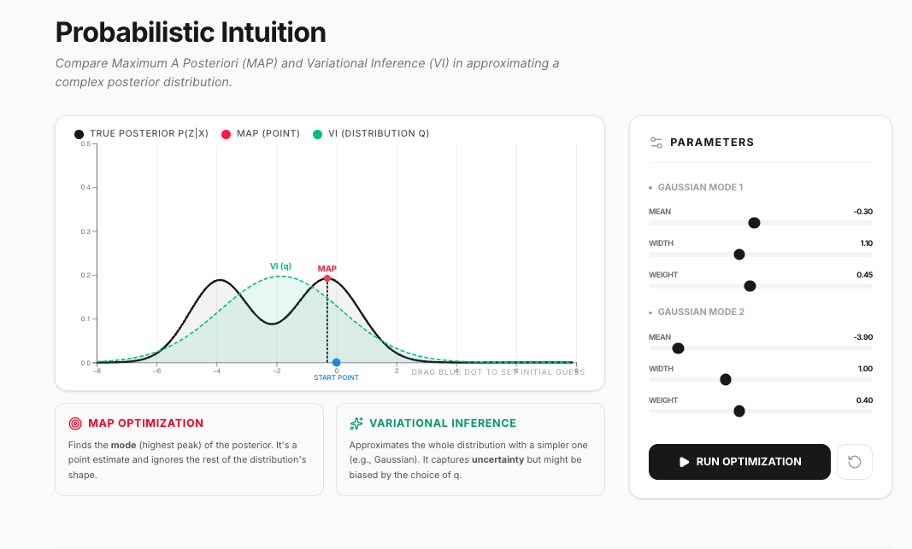

# Mini-understanding

Demos for concepts in statistics, mathemathics and ML.

```bash
sh scripts/build-all.sh
cd dist
python -m http.server
```

Build the GitHub Pages docs locally (fresh dist + generated app index + mkdocs site):

```bash
sh scripts/build_docs.sh
```


